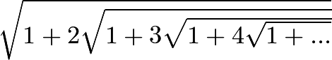
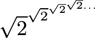
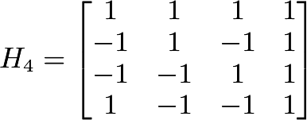

## The latex formulae:

## The latex matrix:

## Projects 1-4:

### Project 1: Organizer

Contributors: 3

Lines of Code: 42912

First Commit: Saturday the week of May 31st

Latest Commit: Wednesday the week of October 11th

Active Branches: There are 7 active branches, with the default being "dummy"

### Project 2: Open Circuits

 Contributors: 33

 Lines of Code: 26796

 First Commit: Tuesday the week of Feb 23rd

 Latest Commit: Sunday the week of December 27th

 Active Branches: There are 6 active branches, with the default being "master"

### Project 3: 990

 Contributors: 1

 Lines of Code: 52372

 First Commit: Tuesday the week of Sep 20th

 Latest Commit: Monday the week of Nov 15th

 Active Branch: There is 1 active branch, "master"

### Project 4: AIPS

 Contributors: 4

 Lines of Code: 343217

 First Commit: Sunday the week of Feb 23rd

 Latest Commit: Tuesday the week of Aug 9th

 Active Branches: There are 3 active branches, with the default being "master"

## Gitstats differences
There were more authors for Organizers and about half as many lines of code.

There were fewer authors for Open Circuits and about the same amount of lines of code.

990 was about the same.

There were more authors for AIPS and much fewer lines of code.
